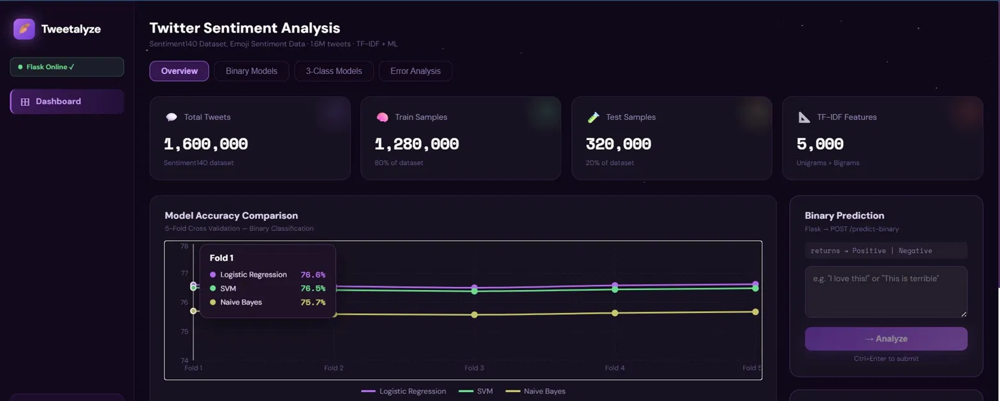
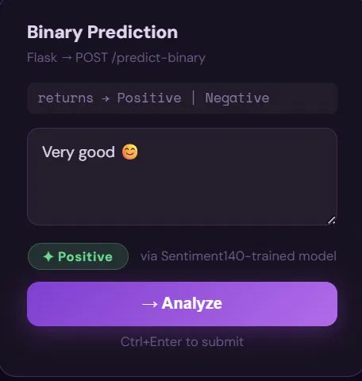
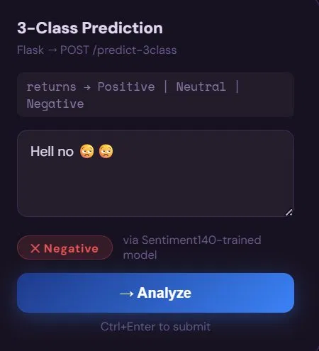
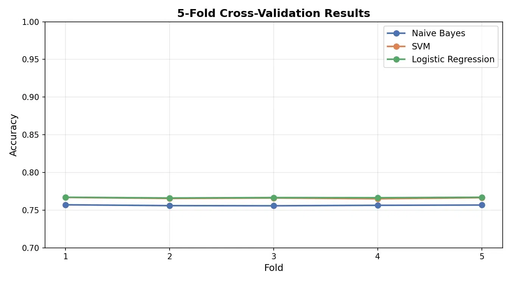
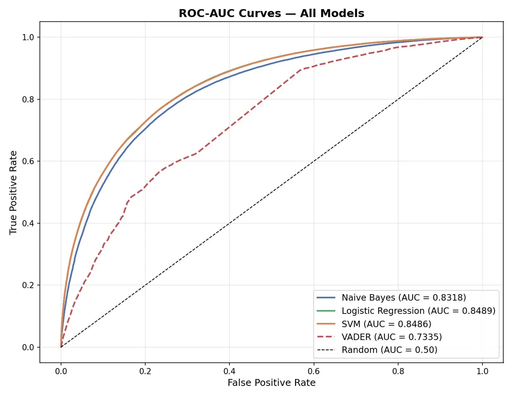
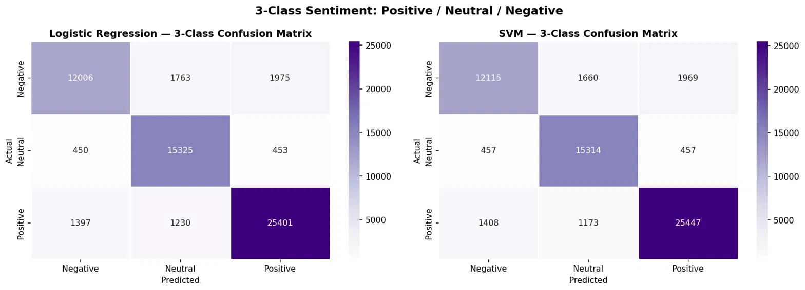
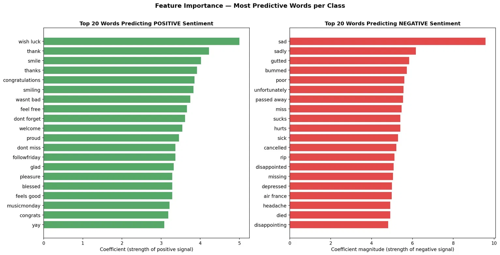

<div align="center">

# 🪶 Tweetalyze
### Twitter Sentiment Analyzer

**A full-stack ML web app that classifies tweet sentiment in real time.**

Trained on **1.6 million tweets** using TF-IDF + Emoji features. Ships with a Binary (Positive/Negative) and a 3-Class (Positive/Neutral/Negative) model — both served via a Flask REST API and visualized in a sleek React dashboard.

[](https://twitter-sentiment-analyzer-7lkh.vercel.app/)
[](https://github.com/rudrasingh-7/Twitter-Sentiment-Analyzer)


</div>

---

## 📸 Preview

<p align="center">
  
</p>

---

## ✨ Features

- 🔴 **Real-time predictions** — type any tweet and get instant sentiment classification
- 🤖 **Two models** — Binary (Positive/Negative) and 3-Class (Positive/Neutral/Negative)
- 😊 **Emoji-aware** — uses Emoji Sentiment Data v1.0 as an additional feature
- 📊 **Interactive dashboard** — cross-validation charts, model comparisons, error analysis, prediction history
- 🌌 **Dark UI** — animated starfield background with a clean purple aesthetic

### Prediction UI

<table>
  <tr>
    <td width="50%">
      
    </td>
    <td width="50%">
      
    </td>
  </tr>
</table>

---

## 📊 Model Performance

| Model | Type | Accuracy |
|---|---|---|
| Logistic Regression (tuned) | Binary | **76.71%** |
| SVM (LinearSVC) | Binary | 76.61% |
| Naive Bayes (Bernoulli) | Binary | 75.65% |
| VADER (baseline) | Binary | 66.40% |
| SVM (LinearSVC) | 3-Class | **88.13%** |
| Logistic Regression | 3-Class | 87.95% |

> Trained on Sentiment140 (1.28M tweets), tested on 320K tweets. TF-IDF with 5,000 features (unigrams + bigrams).

### Evaluation Charts

<table>
  <tr>
    <td width="50%">
      
    </td>
    <td width="50%">
      
    </td>
  </tr>
  <tr>
    <td width="50%">
      
    </td>
    <td width="50%">
      
    </td>
  </tr>
</table>

---

## 🗂️ Project Structure

```
Twitter-Sentiment-Analyzer/
│
├── backend/                          # Flask REST API
│   ├── app.py                        # API routes & prediction logic
│   ├── requirements.txt              # Python dependencies
│   ├── sentiment_model_binary.pkl    # Trained binary classifier
│   ├── sentiment_model_3class.pkl    # Trained 3-class classifier
│   ├── tfidf_vectorizer_binary.pkl   # TF-IDF vectorizer (binary)
│   ├── tfidf_vectorizer_3class.pkl   # TF-IDF vectorizer (3-class)
│   └── Emoji_Sentiment_Data_v1_0.csv
│
├── ml/                               # Research & analysis
│   ├── Twitter_Sentiment_Analysis_Final.ipynb
│   ├── confusion_matrices.png
│   ├── roc_curves.png
│   ├── cross_validation.png
│   ├── feature_importance.png
│   ├── wordcloud.png
│   └── gridsearch_heatmap.png
│
├── tweetalyze/                       # React frontend
│   ├── src/
│   │   ├── Tweetalyze.jsx            # Main app component
│   │   ├── constants.js              # Model stats & chart data
│   │   └── components/
│   │       ├── Tabs.jsx              # Overview, Binary, 3-Class, Error Analysis
│   │       ├── UI.jsx                # Card, Badge, PredictBox, Sidebar
│   │       └── PredictionHistory.jsx
│   └── package.json
│
├── .gitignore
└── README.md
```

---

## 🚀 Running Locally

You need **two terminals** open at the same time.

### Backend — Flask

```bash
cd backend
pip install -r requirements.txt
python app.py
# Runs on http://localhost:5000
```

### Frontend — React

```bash
cd tweetalyze
npm install
npm start
# Opens http://localhost:3000
```

> ⚠️ Keep both terminals running simultaneously.

---

## 🌐 API Reference

Base URL (local): `http://localhost:5000`

| Method | Endpoint | Description |
|---|---|---|
| `GET` | `/` | Health check |
| `POST` | `/predict-binary` | Returns `Positive` or `Negative` |
| `POST` | `/predict-3class` | Returns `Positive`, `Neutral`, or `Negative` |
| `GET` | `/history` | Fetch prediction history |
| `DELETE` | `/history/clear` | Clear prediction history |

**Example request:**
```json
POST /predict-binary
{ "text": "I absolutely love this!" }
```

**Example response:**
```json
{ "type": "binary", "sentiment": "Positive" }
```

---

## 🧠 ML Pipeline

```
Raw Tweet
    ↓
Preprocessing (lowercase, strip URLs/mentions, demojize emoji)
    ↓
TF-IDF Vectorizer (5,000 features, unigrams + bigrams)
    ↓
Emoji Sentiment Score (appended as extra feature)
    ↓
Classifier (Logistic Regression / SVM / Naive Bayes)
    ↓
Sentiment Label
```

**Training steps:**
1. Load Sentiment140 dataset (1.6M tweets)
2. Clean and preprocess text
3. Extract TF-IDF features + emoji sentiment score
4. Train and evaluate 3 classifiers via 5-fold cross-validation
5. Tune best model with GridSearchCV
6. Export model + vectorizer as `.pkl` files

---

## 🛠️ Tech Stack

| Layer | Tech |
|---|---|
| Frontend | React 19, Recharts, DM Sans, Space Mono |
| Backend | Flask, Flask-CORS, Gunicorn |
| ML | scikit-learn, pandas, scipy, joblib, emoji |
| Dataset | Sentiment140 (1.6M tweets), Emoji Sentiment Data v1.0 |
| Deployment | Vercel (frontend), Render (backend) |

---

## 🤝 Contributors

<table>
  <tr>
    <td align="center">
      <a href="https://github.com/rudrasingh-7">
        
        <br />
        <sub><b>Rudra Singh</b></sub>
      </a>
    </td>

    <td align="center">
      <a href="https://github.com/aprakash42">
        
        <br />
        <sub><b>aprakash42</b></sub>
      </a>
    </td>

    <td align="center">
      <a href="https://github.com/amm-09">
        
        <br />
        <sub><b>amm-09</b></sub>
      </a>
    </td>

    <td align="center">
      <a href="https://github.com/Ayushmanitripathi">
        
        <br />
        <sub><b>Ayushmanitripathi</b></sub>
      </a>
    </td>
  </tr>
</table>

---

## 📄 License

This project is open source and available under the [MIT License](LICENSE).

---

<div align="center">
  <sub>Built with Python, React, and 1.6 million tweets ☕ — by <a href="https://github.com/rudrasingh-7">rudrasingh-7</a></sub>
</div>
